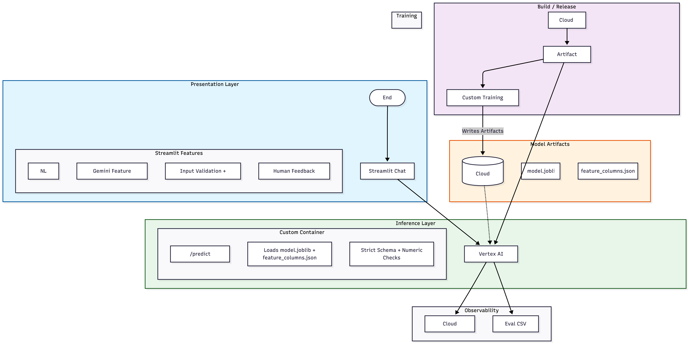

# Fed Reserve Interest Rate Predictions

This project trains a time-series-aware regression model to predict the `Federal Funds Target Rate`.

## Project structure
- `train_interest_rate_model.py`: training + tuning job (HalvingRandomSearchCV)
- `helper_functions.py`: data loading and preprocessing helpers
- `predictor.py`: Flask prediction server for Vertex custom serving
- `Dockerfile.train`: training container
- `Dockerfile`: serving container

## Architecture


### Runtime request flow
1. User sends natural language prompt to Streamlit.
2. Gemini extracts required numeric features in strict JSON format.
3. Streamlit validates ranges and required fields.
4. Streamlit calls Vertex endpoint with structured `instances`.
5. Predictor validates schema and returns prediction.
6. Streamlit renders prediction/explanation and captures human rating.
7. App writes eval row and publishes Cloud Monitoring custom metrics.

### Security and reliability controls
- Input safety: sanitize prompt text, cap request size, cap session request rate.
- Prompt injection resistance: structured extraction prompt with strict output schema.
- Inference hardening: reject unexpected/missing/non-numeric fields.
- Failure isolation: metrics publishing is fail-open (user request still succeeds).
- Observability: latency, success rate, missing-feature rate, human helpfulness metrics.

### Service mapping (AWS-style mental model)
- `Artifact Registry` ~= `Amazon ECR`
- `Cloud Build` ~= `AWS CodeBuild`
- `Cloud Storage` ~= `Amazon S3`
- `Vertex AI Endpoint` ~= `SageMaker Endpoint`
- `Cloud Monitoring` ~= `CloudWatch`

## Training behavior
Training script:
- downloads and prepares data
- performs chronological split
- removes leakage-prone columns from predictors
- tunes a pipeline: preprocessing + SelectFromModel + RandomForest
- evaluates RMSE on held-out chronological test split
- saves artifacts

Saved artifacts:
- `model.joblib`
- `feature_columns.json`

When running on Vertex AI custom training, artifacts are written to `$AIP_MODEL_DIR`.

## Local training
```bash
python train_interest_rate_model.py
```

## Vertex custom training container
    

Run training locally (writes model artifacts to `./model`):
```bash
docker run --rm -e AIP_MODEL_DIR=/app/model -v $(pwd)/model:/app/model gcr.io/<PROJECT_ID>/fed-rate-train:latest
```

## Vertex custom prediction container
Serving container expects mounted model artifacts at `MODEL_DIR` (default `/app/model`):
- `/app/model/model.joblib`
- `/app/model/feature_columns.json`

Build serving image:
```bash
docker build -t gcr.io/<PROJECT_ID>/fed-rate-serve:latest .
```

Run serving locally:
```bash
docker run --rm -p 8080:8080 -e MODEL_DIR=/app/model -v $(pwd)/model:/app/model gcr.io/<PROJECT_ID>/fed-rate-serve:latest
```

Test prediction:
```bash
curl -X POST http://localhost:8080/predict \
  -H "Content-Type: application/json" \
  -d '{"instances":[{"Year":2024,"Month":12,"Day":1,"Inflation Rate":2.8,"Unemployment Rate":4.0}]}'
```

## Notes
- Keep feature schema stable between training and serving.
- For forecasting use cases, avoid contemporaneous leakage-prone features as predictors.

## GenAI Chat Frontend (Streamlit)
This app provides a conversational layer on top of your deployed Vertex prediction endpoint.
It uses Gemini to extract structured model inputs from user text, then calls your endpoint for prediction.

### 1) Install dependencies
```bash
pip install -r requirements.txt
```

### 2) Authenticate for Vertex access
```bash
gcloud auth application-default login
gcloud config set project fed-rate-prediction
```

### 3) Set runtime environment
```bash
export PROJECT_ID="fed-rate-prediction"
export REGION="us-central1"
export VERTEX_ENDPOINT_ID="<YOUR_ENDPOINT_ID>"
export GEMINI_MODEL="gemini-1.5-flash"
export FEATURE_SCHEMA_PATH="model/feature_columns.json"
```

### 4) Launch app
```bash
streamlit run streamlit_app.py
```

### 5) Use the app
- Ask for a prediction in plain English.
- If some fields are missing, complete them in **Manual Inputs (Fallback)**.
- The app returns the predicted Federal Funds Target Rate and a concise explanation.

### Backend Inference + Evaluation Settings
Inference parameters and evaluation logging are configured in backend environment variables (not shown in the user UI):

```bash
export GEMINI_TEMPERATURE="0.2"
export GEMINI_TOP_P="0.95"
export GEMINI_MAX_OUTPUT_TOKENS="512"
export EVAL_LOG_PATH="eval_logs/chat_eval.csv"
```

Each request appends a CSV row with:
- prompt
- extracted features
- missing features
- latency (`extract_ms`, `predict_ms`, `explain_ms`, `total_ms`)
- success flags and prediction value

## Lessons Learned
- Endpoint bugs can look like extraction bugs: Confirmed the deployed model was nearly constant (~1.088-1.094) even when UI inputs changed, so the issue was not only Streamlit parsing.
- Strict extractor contracts need robust fallbacks: Gemini occasionally returned partial/non-JSON output, so deterministic parsing and schema normalization were required to keep inference usable.
- Type/range handling matters for real user phrasing: inputs like `"$24.11 trillion"` can be misinterpreted without explicit numeric normalization and feature-safe bounds.
- Retry strategy is mandatory for GenAI in production: 429/resource exhausted errors required exponential backoff + jitter + call interval throttling + extraction cache.
- Global vs regional endpoint choice affects quota behavior: using global where supported reduced some regional pressure, but does not replace retry/throttle controls.
- SDK/version drift causes avoidable failures: mixing old docs/APIs with newer `google-cloud-aiplatform` and deprecated Gemini SDK paths created fragile behavior.
- Training/serving parity is critical: local retrained model showed healthy spread while deployed model remained near-constant, proving artifact/version mismatch risk in deployment.
- Feature selection can collapse model responsiveness: removing overly aggressive selection and retraining on full numeric features improved prediction spread materially.
- Test harnesses save cost: prompt-sequence and backoff tests reduced manual UI retries and avoided unnecessary paid API calls.

## Next Steps (Next Session)
1. Deploy the freshly retrained artifact bundle (`model.joblib`, `feature_columns.json`, `model_manifest.json`) to Vertex and verify endpoint points to that exact version.
2. Run post-deploy smoke tests with fixed scenarios and assert prediction spread is above threshold before promoting.
3. Add a pre-deploy quality gate in CI/CD:
   - fail if sensitivity `std` is below threshold,
   - fail if required features are missing from schema,
   - fail if model manifest checksum does not match uploaded artifact.
4. Migrate any remaining deprecated Vertex GenAI SDK usage to the current supported `google-genai` flow before June 24, 2026.
5. Keep Gemini cost controls enabled by default in production:
   - extraction cache TTL,
   - bounded retries,
   - low-cost model choice for extraction,
   - explanation generation behind a toggle.
6. Configure Vertex Model Monitoring baselines and alerting for:
   - feature drift,
   - prediction distribution shift,
   - endpoint latency/error spikes.
7. Finish Cloudflare frontend deployment with secure GCP auth pattern (prefer Workload Identity Federation over long-lived keys).
8. Document one canonical “known-good prompt template” in UI and README to reduce malformed user inputs.
