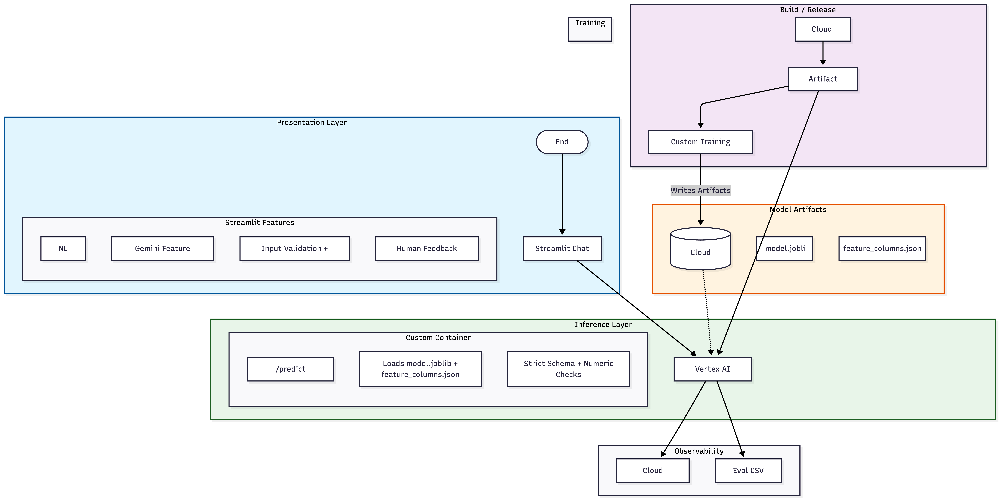

# Fed Reserve Interest Rate Predictions

This project trains a time-series-aware regression model to predict the `Federal Funds Target Rate`.

## Project structure
- `train_interest_rate_model.py`: training + tuning job (HalvingRandomSearchCV)
- `helper_functions.py`: data loading and preprocessing helpers
- `predictor.py`: Flask prediction server for Vertex custom serving
- `Dockerfile.train`: training container
- `Dockerfile`: serving container

## Architecture


### Runtime request flow
1. User sends natural language prompt to Streamlit.
2. Gemini extracts required numeric features in strict JSON format.
3. Streamlit validates ranges and required fields.
4. Streamlit calls Vertex endpoint with structured `instances`.
5. Predictor validates schema and returns prediction.
6. Streamlit renders prediction/explanation and captures human rating.
7. App writes eval row and publishes Cloud Monitoring custom metrics.

### Security and reliability controls
- Input safety: sanitize prompt text, cap request size, cap session request rate.
- Prompt injection resistance: structured extraction prompt with strict output schema.
- Inference hardening: reject unexpected/missing/non-numeric fields.
- Failure isolation: metrics publishing is fail-open (user request still succeeds).
- Observability: latency, success rate, missing-feature rate, human helpfulness metrics.

### Service mapping (AWS-style mental model)
- `Artifact Registry` ~= `Amazon ECR`
- `Cloud Build` ~= `AWS CodeBuild`
- `Cloud Storage` ~= `Amazon S3`
- `Vertex AI Endpoint` ~= `SageMaker Endpoint`
- `Cloud Monitoring` ~= `CloudWatch`

## Training behavior
Training script:
- downloads and prepares data
- performs chronological split
- removes leakage-prone columns from predictors
- tunes a pipeline: preprocessing + SelectFromModel + RandomForest
- evaluates RMSE on held-out chronological test split
- saves artifacts

Saved artifacts:
- `model.joblib`
- `feature_columns.json`

When running on Vertex AI custom training, artifacts are written to `$AIP_MODEL_DIR`.

## Local training
```bash
python train_interest_rate_model.py
```

## Vertex custom training container
    

Run training locally (writes model artifacts to `./model`):
```bash
docker run --rm -e AIP_MODEL_DIR=/app/model -v $(pwd)/model:/app/model gcr.io/<PROJECT_ID>/fed-rate-train:latest
```

## Vertex custom prediction container
Serving container expects mounted model artifacts at `MODEL_DIR` (default `/app/model`):
- `/app/model/model.joblib`
- `/app/model/feature_columns.json`

Build serving image:
```bash
docker build -t gcr.io/<PROJECT_ID>/fed-rate-serve:latest .
```

Run serving locally:
```bash
docker run --rm -p 8080:8080 -e MODEL_DIR=/app/model -v $(pwd)/model:/app/model gcr.io/<PROJECT_ID>/fed-rate-serve:latest
```

Test prediction:
```bash
curl -X POST http://localhost:8080/predict \
  -H "Content-Type: application/json" \
  -d '{"instances":[{"Year":2024,"Month":12,"Day":1,"Inflation Rate":2.8,"Unemployment Rate":4.0}]}'
```

## Notes
- Keep feature schema stable between training and serving.
- For forecasting use cases, avoid contemporaneous leakage-prone features as predictors.

## GenAI Chat Frontend (Streamlit)
This app provides a conversational layer on top of your deployed Vertex prediction endpoint.
It uses Gemini to extract structured model inputs from user text, then calls your endpoint for prediction.

### 1) Install dependencies
```bash
pip install -r requirements.txt
```

### 2) Authenticate for Vertex access
```bash
gcloud auth application-default login
gcloud config set project fed-rate-prediction
```

### 3) Set runtime environment
```bash
export PROJECT_ID="fed-rate-prediction"
export REGION="us-central1"
export VERTEX_ENDPOINT_ID="<YOUR_ENDPOINT_ID>"
export GEMINI_MODEL="gemini-1.5-flash"
export FEATURE_SCHEMA_PATH="model/feature_columns.json"
```

### 4) Launch app
```bash
streamlit run streamlit_app.py
```

### 5) Use the app
- Ask for a prediction in plain English.
- If some fields are missing, complete them in **Manual Inputs (Fallback)**.
- The app returns the predicted Federal Funds Target Rate and a concise explanation.

### Backend Inference + Evaluation Settings
Inference parameters and evaluation logging are configured in backend environment variables (not shown in the user UI):

```bash
export GEMINI_TEMPERATURE="0.2"
export GEMINI_TOP_P="0.95"
export GEMINI_MAX_OUTPUT_TOKENS="512"
export EVAL_LOG_PATH="eval_logs/chat_eval.csv"
```

Each request appends a CSV row with:
- prompt
- extracted features
- missing features
- latency (`extract_ms`, `predict_ms`, `explain_ms`, `total_ms`)
- success flags and prediction value

## Lessons Learned
- When the model wasn't producing the correct predictions, it was because the model was not retrained after the feature selection was changed. I had to go back to the original feature selection and project scoping by looking at the original dataset, look at the loss function, and retrain the model.
- Endpoint bugs can look like extraction bugs: Confirmed the deployed model was nearly constant (~1.088-1.094) even when UI inputs changed, so the issue was not only Streamlit parsing.
- Strict extractor contracts need robust fallbacks: Gemini occasionally returned partial/non-JSON output, so deterministic parsing and schema normalization were required to keep inference usable.
- Type/range handling matters for real user phrasing: inputs like `"$24.11 trillion"` can be misinterpreted without explicit numeric normalization and feature-safe bounds.
- Retry strategy is mandatory for GenAI in production: 429/resource exhausted errors required exponential backoff + jitter + call interval throttling + extraction cache.
- Global vs regional endpoint choice affects quota behavior: using global where supported reduced some regional pressure, but does not replace retry/throttle controls.
- SDK/version drift causes avoidable failures: mixing old docs/APIs with newer `google-cloud-aiplatform` and deprecated Gemini SDK paths created fragile behavior.
- Training/serving parity is critical: local retrained model showed healthy spread while deployed model remained near-constant, proving artifact/version mismatch risk in deployment.
- Feature selection can collapse model responsiveness: removing overly aggressive selection and retraining on full numeric features improved prediction spread materially.
- Test harnesses save cost: prompt-sequence and backoff tests reduced manual UI retries and avoided unnecessary paid API calls.

## Deployment Gates and Smoke Criteria
Hard thresholds and pass/fail rules are documented in:
- `docs/deploy_checklist.md`

Quick commands added for this workflow:
- `scripts/vertex_endpoint_control.sh` (status/undeploy/deploy endpoint models)
- `scripts/smoke_test_vertex_endpoint.py` (fixed-scenario prediction spread checks)
- `scripts/release_gate.sh` (single entrypoint for precheck/smoke/full gate + quick undeploy)

### Release Gate Commands
```bash
# Local artifact + schema checks
./release_gate.sh precheck

# Deploy model; creates endpoint automatically if VERTEX_ENDPOINT_ID is unset
PROJECT_ID="fed-rate-prediction" REGION="us-central1" MODEL_ID="<MODEL_ID>" \
./release_gate.sh deploy

# Or deploy by display name (auto-picks latest matching model)
PROJECT_ID="fed-rate-prediction" REGION="us-central1" MODEL_DISPLAY_NAME="fed-rate-train" \
./release_gate.sh deploy

# Or fully automatic (picks latest model in project/region)
PROJECT_ID="fed-rate-prediction" REGION="us-central1" \
./release_gate.sh deploy

# Recommended: constrain auto-pick to your custom container image to avoid foundation models
PROJECT_ID="fed-rate-prediction" REGION="us-central1" MODEL_IMAGE_HINT="elisheba/fed-rate-predictions" \
./release_gate.sh deploy

# Full gate: precheck + smoke test against endpoint
PROJECT_ID="fed-rate-prediction" REGION="us-central1" VERTEX_ENDPOINT_ID="<ENDPOINT_ID>" \
./release_gate.sh run

# One-command cost control (undeploy all models from endpoint)
./release_gate.sh undeploy "<ENDPOINT_ID>"
```

### Model Selection Safety (Important)
- `scripts/release_gate.sh deploy` now avoids accidental deployment of foundation models (for example Gemma) by filtering candidate models using `containerSpec.imageUri`.
- Default behavior uses `MODEL_IMAGE_HINT="fed-rate"` for auto-selection.
- For strongest safety, set:
  - `MODEL_IMAGE_HINT="elisheba/fed-rate-predictions"`
- If no matching custom model is found, deploy fails fast with a clear error.

## Today's Progress (2026-03-02)
- [x] Defined hard deployment gates and smoke acceptance thresholds in `docs/deploy_checklist.md`.
- [x] Added endpoint automation scripts for status/deploy/undeploy and endpoint auto-creation.
- [x] Added smoke test script with 5 fixed scenarios and spread/std/latency assertions.
- [x] Added unified `scripts/release_gate.sh` for `precheck`, `deploy`, `smoke`, `run`, and `undeploy`.
- [x] Added automatic model ID resolution by `MODEL_ID`, `MODEL_DISPLAY_NAME`, or latest matching custom image.
- [x] Added one-command undeploy path for cost control.

## Cost Optimization Strategy (Phased)
### Why this order
The fastest low-risk cost reduction is to automate Vertex endpoint undeploy/redeploy first. It prevents idle endpoint spend now without changing app architecture. Cloud Run is still the target serving path once release readiness is higher because request-based billing with min instances at zero is better for bursty traffic.

Batch prediction remains useful for offline jobs, but this app is interactive, so batch does not replace online serving.

### Phase 1: Immediate cost controls (now)
1. Schedule endpoint undeploy outside active hours.
2. Redeploy during planned usage windows.
3. Keep Gemini runtime controls enabled:
   - cache extraction results,
   - bounded retries and call pacing,
   - lower-cost extraction model,
   - optional explanation toggle.

### Phase 2: Stable release path (next)
1. Enforce pre-deploy checklist gates (`docs/deploy_checklist.md`).
2. Deploy artifact bundle (`model.joblib`, `feature_columns.json`, `model_manifest.json`) only when gates pass.
3. Run smoke tests and require prediction spread thresholds before promotion.

### Phase 3: Cost-optimized serving target (after stability)
1. Migrate predictor serving from always-on Vertex endpoint to Cloud Run for request-based billing.
2. Keep Vertex training artifacts and optional rollback endpoint.
3. Re-evaluate serving platform using real traffic and latency/error SLOs.

## Next Steps (Prioritized)
4. Migrate any remaining deprecated Vertex GenAI SDK usage before June 24, 2026.
5. Configure Vertex Model Monitoring baselines/alerts for drift, distribution shift, and latency/error spikes.
6. Finish Cloudflare frontend deployment with secure GCP auth (prefer Workload Identity Federation over long-lived keys).
7. Document one canonical “known-good prompt template” in UI and README to reduce malformed user inputs.
